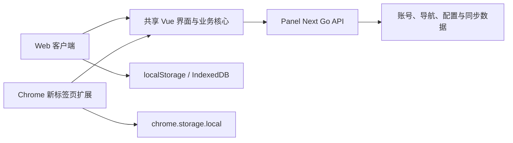

<div align="center">


# Panel Next

**一个面向 Web 与 Chrome 新标签页的自托管导航面板**

[](./LICENSE)
[](https://github.com/RoaycL/panel-next)
[](https://github.com/RoaycL/panel-next/blob/main/TODO.md)

</div>

Panel Next 基于 [Sun-Panel](https://github.com/hslr-s/sun-panel) 最后一个 MIT 开源版本 `v1.3.0` 独立演进。项目一方面根据公开文档和可观察行为独立补齐后续公开能力，另一方面建设共用同一后端、账号和数据的 Web/Chrome 新标签页双端架构。

Web 模式保持自托管导航面板的现有使用方式；Chrome 扩展模式覆盖浏览器新标签页，逐步提供类似 iTab 的快捷入口、组件布局和跨设备同步体验。

> [!IMPORTANT]
> 当前项目处于积极开发阶段，尚未发布稳定版，也未发布到 Chrome Web Store。继续开发请先阅读 [主待办清单](https://github.com/RoaycL/panel-next/blob/main/TODO.md)、[双端架构](https://github.com/RoaycL/panel-next/blob/main/doc/web_extension_architecture.md)、[Chrome 扩展开发说明](https://github.com/RoaycL/panel-next/blob/main/doc/chrome_extension_development.md) 和 [开放功能对齐路线图](https://github.com/RoaycL/panel-next/blob/main/OPEN_FEATURE_PARITY.md)。

## 项目方向

- **一个后端，两个客户端**：Web 与 Chrome 新标签页共享 Go 后端、账号体系和业务数据。
- **保持自托管**：用户掌控服务地址、账号、导航数据、图片和配置。
- **渐进式演进**：保留现有 Vue/Go 主体，通过运行环境、存储、会话和同步适配器逐步解耦。
- **最小权限扩展**：Chrome 扩展默认只使用本地存储，连接服务器时才申请用户所选 Origin 的访问权限。
- **安全同步**：后端作为数据权威来源，后续提供可撤销设备会话、缓存回退、版本协商和冲突处理。
- **独立实现**：只使用 MIT 源码、公开文档和可观察行为，不反编译、不提取或复制闭源代码与资源。

## 双端架构



- Web 使用同源 `/api`，保持已有部署和访问方式。
- Chrome 扩展使用可配置的服务器 Origin，并通过公开接口验证兼容性。
- 扩展本地状态按服务器 Origin 隔离，避免切换实例时混用会话。
- 服务器数据、设备会话和离线缓存将按照路线图逐步实现版本化同步。

## 当前进度

### 已完成

- 升级 Vue、Vite、TypeScript、pnpm 等前端工具链，并建立 Web/Extension 双产物构建。
- 实现 SQLite 完整备份恢复、MySQL 逻辑备份迁移、校验、快照与失败回滚。
- 建立 Manifest V3 新标签页扩展入口和共享 `RuntimeAdapter` / `StorageAdapter`。
- 接入 `chrome.storage.local` 预加载内存镜像，按服务器 Origin 隔离数据。
- 实现服务器地址配置、兼容性验证、按 Origin 授权和服务器切换。

### 正在推进

- 扩展端账号登录验证及共享首页数据加载。
- 分组、卡片、面板配置和缓存同步。
- 全局品牌、图库、验证码、多账号、Docker 管理等公开能力对齐。

### 后续阶段

- 可撤销的多设备 Access/Refresh Token 会话。
- 版本化 bootstrap、增量同步、离线缓存和冲突处理。
- 时钟、天气、热搜、倒计时及可拖放组件系统。
- Web 镜像、扩展 ZIP、自动校验和 Chrome Web Store 发布准备。

完整状态以 [TODO.md](./TODO.md) 和 [OPEN_FEATURE_PARITY.md](./OPEN_FEATURE_PARITY.md) 为准。

## 当前界面


当前截图主要展示继承自开源基线的 Web 导航能力。Chrome 新标签页体验和组件化布局仍在持续开发。

## 本地开发

### 环境要求

- Node.js `>= 22.13`
- pnpm `11.20.0`（以 `package.json` 的 `packageManager` 字段为准）
- Go `>= 1.20`
- SQLite 相关 Go 构建需要可用的 CGO/C 编译环境

### 获取代码

```powershell
git clone https://github.com/RoaycL/panel-next.git
cd panel-next
git switch codex/open-feature-parity
corepack enable
corepack pnpm install
```

### 前端开发与构建

```powershell
# Web 开发服务器
corepack pnpm run dev:web

# 类型检查、Web 构建、Extension 构建及扩展包校验
corepack pnpm run build:all
```

构建产物：

- Web：`dist`
- Chrome 扩展：`dist/extension`

扩展本地加载步骤见 [Chrome 扩展开发说明](./doc/chrome_extension_development.md)。

### 后端验证

```powershell
cd service
go test ./...
go vet ./...
```

## 开发约定

1. 开始任务前先查看 [TODO.md](./TODO.md)，按条目编号推进并更新状态。
2. Web 功能必须保持兼容；扩展能力通过运行环境适配器接入，不在共享核心中直接散布 `chrome.*` 调用。
3. 数据库、认证、备份和同步变更必须覆盖失败、回滚和账号隔离场景。
4. 提交前至少执行相关类型检查、测试以及 Web/Extension 生产构建。
5. 不提交服务器凭据、用户数据、`.env`、源码映射或扩展开发密钥。

## 来源、边界与许可

Panel Next 的代码历史源自 Sun-Panel `v1.3.0` MIT 开源版本，并保留原项目的版权与许可信息。本项目是社区独立演进项目，不是 Sun-Panel 官方版本，也不代表原作者或原项目维护者。

后续能力的实现遵守以下边界：

- 允许使用 MIT 开源代码、官方公开文档、公开发行说明和正常使用时可观察的行为。
- 不下载闭源版本用于分析，不反编译、不反汇编、不提取资源、不复制闭源实现。
- 对齐的是公开描述的产品能力，不复刻闭源授权机制、品牌素材或内部实现。

项目继续以 [MIT License](./LICENSE) 发布。感谢 Sun-Panel 原作者及所有历史贡献者奠定的开源基础。
