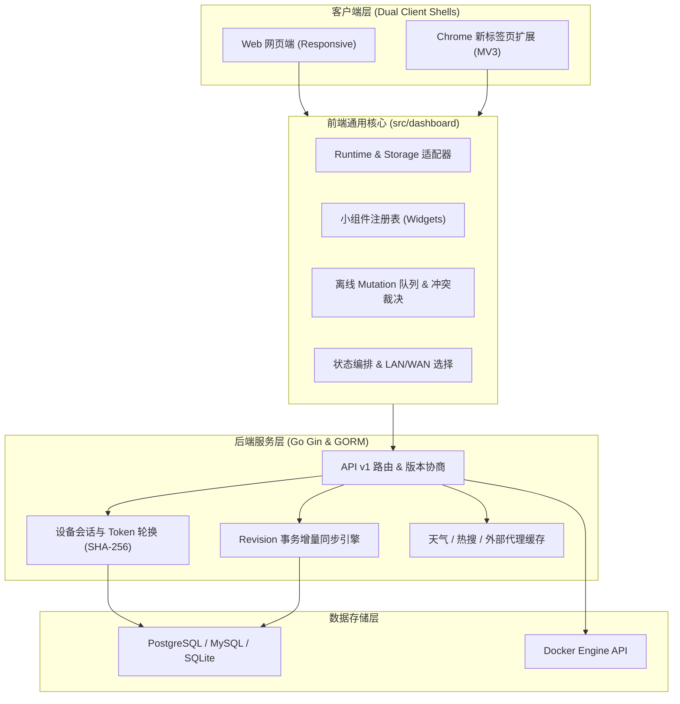

<div align="center">


# Panel Next

**下一代自托管导航面板 · Web 与 Chrome 扩展新标签页双端桌面**

[](./LICENSE)
[](https://github.com/RoaycL/panel-next)
[](https://github.com/RoaycL/panel-next/releases)

[功能特性](#-功能特性) • [快速开始](#-快速开始) • [Chrome 扩展安装](#-chrome-扩展安装) • [系统架构](#-系统架构) • [开发指南](#-本地开发) • [开源协议](#-开源协议)

</div>

---

## 📖 项目简介

**Panel Next** 是一款现代化的自托管个人导航面板与浏览器新标签页系统。项目基于开源基线独立演进，提供强大的 **Web 网页端** 与 **Chrome 扩展新标签页（Manifest V3）** 双端无缝协同体验。

> 当前处于测试阶段，版本从 `0.0.1` 开始并限定在 `0.0.x` 系列。测试完成前请勿标记为正式版或使用 `1.x` 版本号。

无论是在家庭服务器、NAS、云主机上自托管，还是作为日常浏览器的默认新标签页，Panel Next 都能为您提供极致丝滑、美观高雅、高度可定制的数字化仪表盘。

---

## ✨ 功能特性

### 🖥️ 1. 双端深度协同 (Web & Chrome Extension)
- **一个后端，双端体验**：Web 首页与 Chrome 新标签页共用账号、分组和书签数据；两端的壁纸、样式与小组件显示偏好分别保存，互不覆盖。
- **离线快照与即时秒开**：扩展新标签页支持本地可信快照预加载，断网或网络抖动时依然瞬时打开，恢复联网后自动后台增量刷新。
- **细粒度权限控制**：Chrome 扩展遵循最小权限原则，仅声明 `storage` 权限，连接自建服务器时按需申请 Origin 授权。

### 🧩 2. iTab 风格小组件系统 (Widget Framework)
- **丰富内置组件**：
  - **大号数字时钟 & 实时日期**：支持秒针显示、多种样式自由切换；
  - **多源聚合搜索框**：内置百度、必应、Google 等主流引擎，支持自定义搜索及 Tab 快捷切换；
  - **实时天气组件**：基于 Open-Meteo 代理，支持公制/英制、WMO 状态图标、内存缓存与离线陈旧降级；
  - **全网热搜/资讯滚动**：支持微博热搜、百度热榜、知乎热榜、Hacker News 多数据源聚合，支持轮播滚动与链接安全直达；
  - **纪念日 & 倒计时**：纯本地高精度计算，支持农历/公历周年日自动滚动，重要日子绝不错过。
- **12 列响应式网格布局**：支持拖拽手柄自由排序、按步长缩放宽高、隐藏/显示组件，布局随账号实时多端同步。

### 🔄 3. 强一致增量同步与离线冲突裁决
- **账号级单调 Revision**：每次数据修改均由服务端原子递增版本并串行化 Changes 日志。
- **离线 Mutation 队列**：网络离线期间书签增删改查、排序、样式修改安全持久化入队，联网后 FIFO 自动重放。
- **拒绝最后写入静默覆盖 (No Silent LWW)**：内置并发冲突检测机制与可视化裁决对话框，支持「保留本地覆盖云端」、「保留云端放弃本地」、「另存为离线副本」三种裁决策略。

### 🖼️ 4. Wallhaven 超清壁纸库与沉浸式 UI
- **Wallhaven 官方源接入**：内置 4K/8K 热门、最新、随机壁纸库，一键更换桌面背景。
- **高级视觉特效**：支持背景高斯模糊（0~20px）与暗色遮罩透明度自由调节，完美兼顾壁纸美感与文字可读性。
- **精致暗黑模式**：全栈组件、模态框、抽屉导航采用统一的极简毛玻璃暗色设计，质感出众。

### 🌐 5. 局域网 / 公网自适应模式 (LAN & WAN)
- **双地址智能解析**：每个书签卡片支持分别配置内网地址 (LAN URL) 与公网地址 (WAN URL)。
- **一键切换**：在顶部控制栏或快捷抽屉一键切换网络模式，内网环境下极速直达，外网环境下安全穿透。

### 🐳 6. Docker 容器集成与系统监控
- **容器自动发现**：连接 Docker Daemon 自动枚举运行中容器，一键将其转换为桌面快捷方式并关联容器状态。
- **实时系统监控**：CPU 负载、内存占用、磁盘空间可视化仪表盘展示。

### 🔐 7. 企业级安全与设备会话管理
- **现代化设备会话**：256 位哈希 Token、30 天轮换 Refresh Token、防重放攻击与多设备独立软撤销。
- **全数据库兼容**：开箱支持 **PostgreSQL 17**、**MySQL** 与 **SQLite**，支持版本化逻辑备份迁移与自动序列校准。

---

## 🚀 快速开始

### 方式一：Docker Compose 一键部署（推荐）

1. 创建 `docker-compose.yml` 文件：

```yaml
version: '3.8'

services:
  panel-next:
    image: ghcr.io/roaycl/panel-next:latest
    container_name: panel-next
    restart: always
    ports:
      - "3003:3003"
    volumes:
      - ./data:/app/data
      - /var/run/docker.sock:/var/run/docker.sock:ro # 可选：如需 Docker 容器管理功能
    environment:
      - TZ=Asia/Shanghai
```

2. 启动服务：

```bash
docker compose up -d
```

3. 浏览器访问：`http://<你的服务器IP>:3003`（默认管理员账号：`admin`，默认密码：`123456`，请首次登录后立即修改密码）。

---

## 🧩 Chrome 扩展安装

Panel Next 扩展将彻底接管浏览器的新标签页，提供如同原生桌面般强大的操作体验。

1. 前往 GitHub [Releases 页面](https://github.com/RoaycL/panel-next/releases) 下载最新的测试包 `panel-next-extension-v0.0.1.zip`；
2. 解压 ZIP 压缩包到本地目录；
3. 打开 Chrome 浏览器，访问 `chrome://extensions/`；
4. 开启右上角的 **「开发者模式 (Developer mode)」**；
5. 点击左上角的 **「加载已解压的扩展程序 (Load unpacked)」**，选择刚才解压的目录；
6. 新建一个标签页，即可看到 Panel Next 桌面；点击左侧个人中心，输入您的服务端地址（例如 `http://192.168.1.100:3003`）即可完成绑定并同步分组与书签。扩展样式和小组件显示偏好在扩展内独立设置。

---

## 🏗️ 系统架构



---

## 💻 本地开发

### 前置环境
- **Node.js**: `>= 22.13`
- **pnpm**: `11.20.0`
- **Go**: `>= 1.20`
- **PostgreSQL**: `>= 14` (推荐 17)

### 1. 克隆项目与安装依赖
```bash
git clone https://github.com/RoaycL/panel-next.git
cd panel-next
corepack enable
pnpm run bootstrap
```

### 2. 启动开发服务器
```bash
# 启动前端开发调试服务
pnpm run dev:web

# 启动后端服务
cd service
go run main.go
```

### 3. 构建与全量测试
```bash
# 运行全套架构规则、类型检查、快照缓存、小组件与双端打包验证
pnpm run build:all

# 打包 Chrome 扩展 ZIP
pnpm run package:extension
```

---

## 📄 文档索引

- [双端架构技术规范](./doc/web_extension_architecture.md)
- [Chrome 扩展开发与适配说明](./doc/chrome_extension_development.md)
- [Chrome Web Store 发布清单](./doc/chrome_store_release.md)
- [升级、回滚与版本兼容矩阵](./doc/upgrade_rollback_compatibility.md)
- [设备会话安全设计](./doc/device_session_security.md)
- [备份与恢复说明](./doc/backup_restore_fork.md)
- [隐私政策](./doc/privacy.md)
- [支持与帮助文档](./doc/support.md)

---

## 📜 开源协议

Panel Next 代码历史源自 Sun-Panel `v1.3.0` MIT 开源版本，后续功能均基于开源基线、公开文档与标准规范独立演进实现。

项目完整遵守 [MIT License](./LICENSE) 协议发布。感谢开源社区以及所有历史贡献者的卓越付出！
